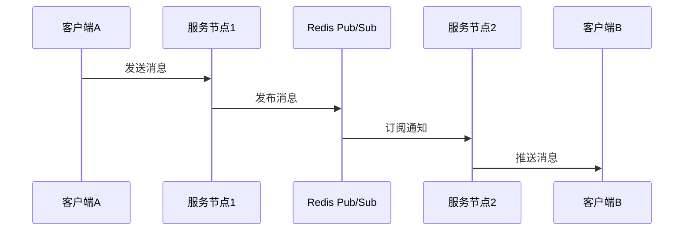
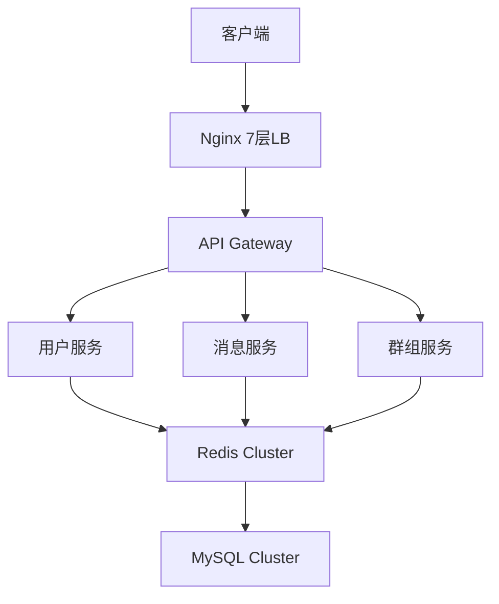

# EasyChat - 企业级即时通讯解决方案

## 🌟 项目概述
EasyChat 是一款基于Spring Cloud + Netty构建的高性能分布式即时通讯系统，提供完整的用户社交、群组管理、消息传输和系统管理能力。系统日均支持百万级消息处理，满足企业级IM场景需求。

## 🏗️ 核心模块

### 1. 用户认证模块

```java

// 示例：JWT令牌生成

public String generateToken(User user) {

    return Jwts.builder()
        .setSubject(user.getUserId())
        .setIssuedAt(new Date())
        .signWith(SignatureAlgorithm.HS256, SECRET_KEY)
        .compact();
}
```

- 🔐 安全体系：
  - 双重验证（账号密码+图形验证码）
  - AES传输加密 + BCrypt存储加密
  - JWT无状态认证
- ⚡ 在线状态管理：
  - Redis实时维护用户会话
  - Netty Channel绑定用户ID

### 2. 关系网络架构
| 关系类型 | 功能特性 | 数据一致性保障 |
|---------|----------|----------------|
| 好友关系 | 申请/审批流程 | 双写事务+最终一致性 |
| 群组关系 | 分级权限控制 | 分布式事务补偿 |
| 黑名单 | 消息拦截 | 实时缓存更新 |

### 3. 消息传输引擎


​核心特性​​：
    多端消息同步（Web/App/PC）
    文件预上传通知机制
    分布式消息路由（跨服务器投递）
    消息类型扩展体系（支持15+消息类型）

### 4. 群组管理系统

    🏢 群组容量控制：
        默认500人/群
        可配置扩容至2000人
    ⚙️ 分级权限：
```properties
# 权限级别配置示例
group.role.owner=CREATE|DELETE|MANAGE_MEMBER
group.role.admin=MANAGE_MEMBER|PIN_MESSAGE
group.role.member=SEND_MESSAGE
```
### 5. 管理控制台
📊 实时监控看板：
- 在线用户统计
- 消息吞吐量监控
- 异常连接预警

🔧 系统配置中心：
- 敏感词动态更新
- 版本灰度发布控制
- 服务器节点管理

## 🚀 技术架构

| 技术栈        | 用途            | 版本         |
|---------------|-----------------|-------------|
| **Spring Cloud**  | 微服务架构       | 2022.0.3    |
| **Netty**         | 长连接维护       | 4.1.86      |
| **Redis**         | 缓存/消息总线    | 7.0         |
| **MySQL**         | 关系型存储       | 8.0         |
| **MinIO**         | 文件存储         | RELEASE.2023|



## 📦 功能清单
- ✅ 完备的IM功能（单聊/群聊/已读回执）
- ✅ 安全审计日志（消息溯源）
- ✅ 多端消息同步（最多支持8个设备）
- ✅ 高性能文件传输（断点续传+分片上传）
- ✅ 智能消息路由（离线消息缓存）

## 📈 性能指标
| 场景         | QPS（次/秒） | 平均延迟 | 服务可用性 |
|--------------|-------------:|---------:|-----------:|
| **消息发送** | 50,000       | 15ms     | 99.99%     |
| **群消息广播** | 20,000      | 50ms     | 99.98%     |
| **文件传输** | 5,000        | 100ms    | 99.95%     |