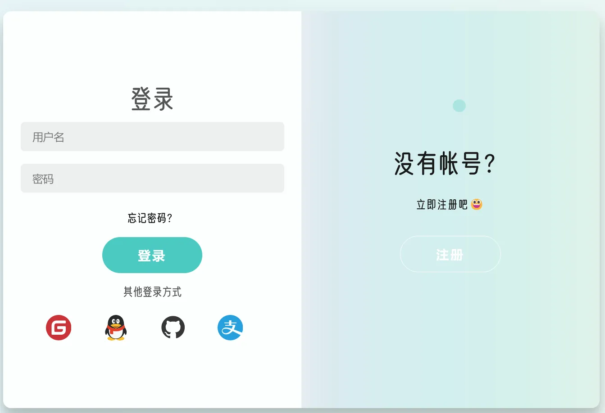
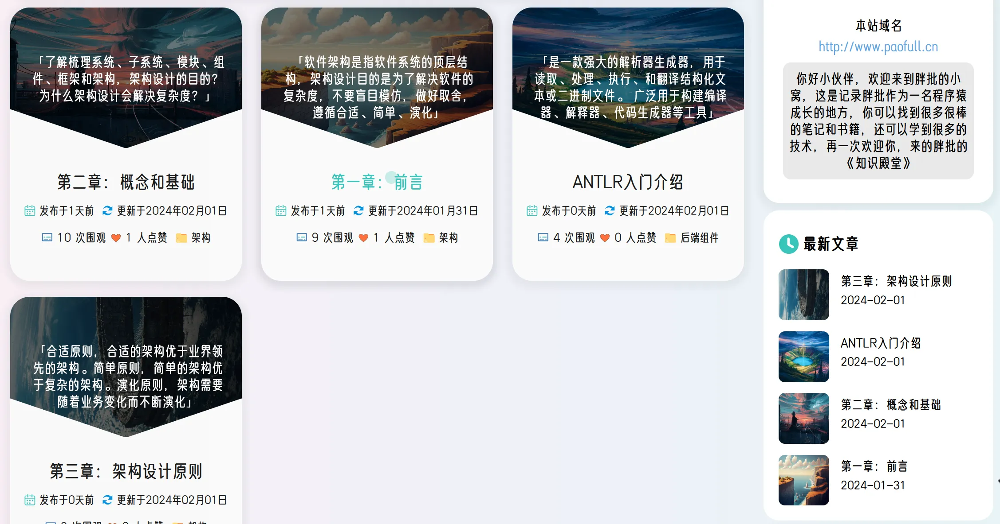
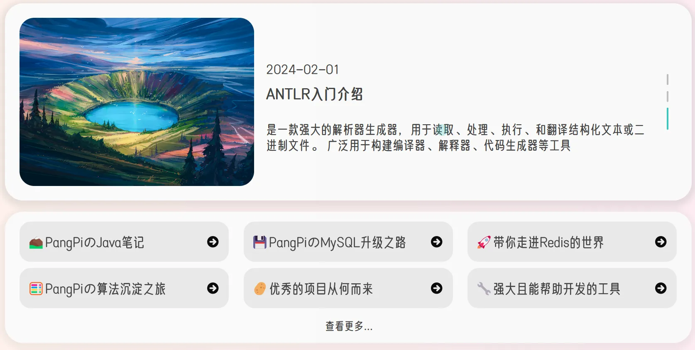
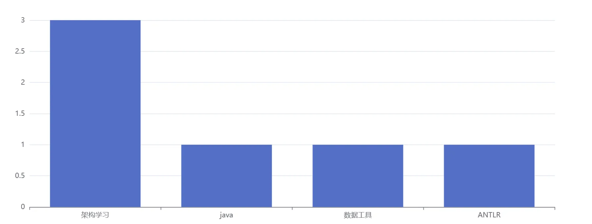
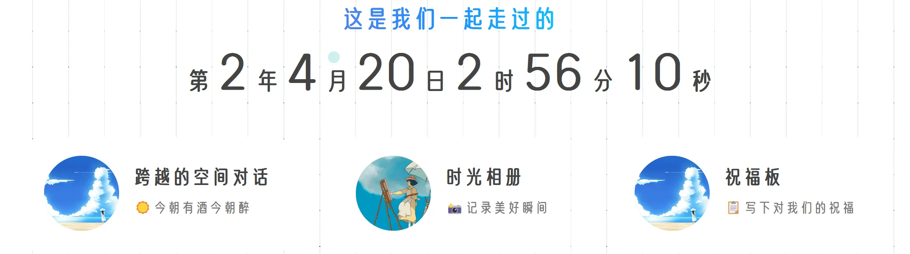
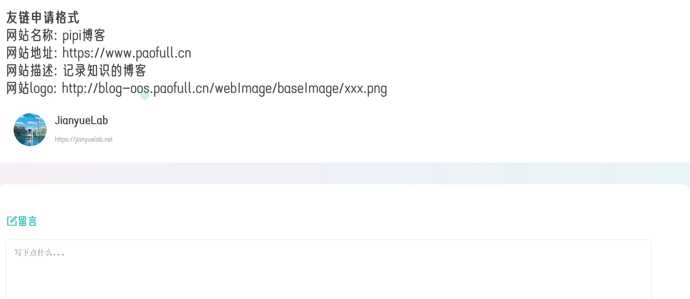
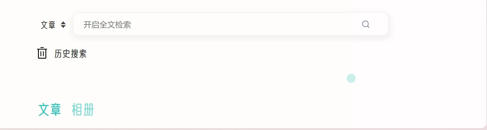
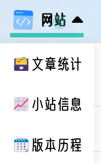

## 技术栈

前端：vue

后端：Spring，ES全文检索，Redis缓存存储

外部组件：qiuniuyun静态存储+CDN加速，腾讯云备案提供，Gitee提供代码仓库

## 初识

> 访问者你好，欢迎来到pipi博客！这个网站使用了一些最新的技术来提供更好的用户体验和性能。很高兴在这里见到你，但是作为站长，我不得不提醒你最好使用PC打开此网页，因为本站暂未适配手机和平板等设备，所以你如果在手机端打开可能看到的是极其丑陋的页面。如果非要使用手机或平板打开，可以尝试横屏观看。

## 小站技术栈

本项目是一个前后端分离项目，使用的主要技术如下：

+ 前端采用了 Vue 框架，这是一个流行的 JavaScript 框架。Vue 框架具有简单易用、高效灵活、组件化等优点。采用 Vue 框架本站具有良好的交互性和可维护性，同时使用了多个前端JS组件完善前端功能。
+ 后端框架使用Spring，脚手架使用SpringBoot(版本2.5.0)，后端架构为Tomcat加上传统的SpringMVC，能快速的搭建 Web 应用程序，并且提供数据持久化能力。
+ 为了实现高效的搜索功能，本站选择了 Elasticsearch 全文检索引擎。Elasticsearch 是一个基于 Lucene 的分布式搜索引擎，它可以快速地搜索大量的文本数据，并提供了丰富的查询语言和聚合功能。我们使用 Elasticsearch 来存储博客文章的内容和元数据，并使用其提供的搜索 API 来实现快速、准确的搜索功能。
+ 同时为了降低后端数据获取延迟，使用Redis作为缓存存储技术来缓存一些常用数据，同时减少对数据库的直接访问。
+ 为了优化静态资源的加载速度，使用了七牛云的静态存储和 CDN 加速服务。七牛云是国内领先的云存储服务提供商，提供了高可靠性、高可扩展性、高安全性的云存储服务。将本站的静态资源（如图片、CSS、JavaScript 文件）存储在七牛云上，并使用其 CDN 加速服务，可以使本站的静态资源的访问速度更快、更稳定。
+ 同时使用Trie树实现的AC自动机，提供了敏感词检测和屏蔽功能，能较为快速的分析评论、文字等内容是否存在违规词语。
+ 接入JustAuth工具包提供了第三方登录并入主路登录中，提供更加完善的登录机制

## 当前版本

本项目当前版本为预览版V-0.5.0，目前提供的功能如下：

**前台页面的登录与注册**

提供了gitee和github的第三方登录，以及邮箱注册功能

**文章快速浏览**

首页提供置顶文章，侧边栏提供最新发布的文章以及轮播推荐文章(本站的高质量文章也不少哦😯，悄悄收藏一下吧)

**分类与标签统计**

提供标签以及分类的统计和统计图标，更加清晰和直观查看文章的分类以及标签分布情况。

同时本站还担任着另一个任务，就是记录生活，所以提供了我与“夫人”的记录功能模块，“伊人”，正所谓“所谓伊人，在水一方”，所谓我在这里敲代码，心里还想着儿女情长🤪

伊人模块主要提供了隔空传话聊天功能(只限于我俩用)😎，相册模块，记录了生活的点点滴滴，照骗啦，以及祝福板功能，快去写下对我们的祝福吧😉

**友人帐**

本站对外开放友链，根据页面的友链提示完成友链申请，等待审核通过后就可以在友链页面直通你的网站啦。

**搜索检索**

同时提供了全文检索功能，对文章主要是文章的标题和分类以及标签和简介内容进行检索，相册检索则是检索相册名称，相册简介，相册标题内容检索

**本站相关的统计**

主要提供本站信息的统计，文章发布趋势，文字总字数等等

## 未来

因为还有些许功能和页面暂时未开发完成，比如你可以在首页看到很多的菜单栏可以选择，会提示正在开发中，敬请期待的文字。由于本人一人兼顾前后端的开发并且白天还是一个社畜帕鲁，可能预计今年夏天，也就是7或8月左右完成V-1.0.0的开发功能。希望你能期待后续功能

1. 文章详情页提供相关推荐，以及标签展示，提供更好的跳转和文章查阅功能
2. 提供本项目的git提交日志，版本历程功能上线
3. 网站精选内容，提供别的网站精选的内容，提供直接跳转功能
4. 我的说说功能，提供类似朋友圈的功能，谁不想偶尔吐槽吐槽呢
5. 音乐模块，音乐能带来轻松，翻阅文章之余，伴随着轻快的音乐未尝不是一件美事
6. 观影小剧场，提供第三方视频观看功能以及主站的视频放映功能
7. 页面深浅色切换，带来熬夜阅读更好的体验

## 感谢

最后，再次感谢你访问我的博客网站。如果你对我的文章有任何问题或建议，请随时在本文章的评论区中留言，我会尽快回复你。😁